# Hometown
I am from the Bay Area in the beautiful Oakland hills! I grew up with my sister, my parents, my Baba, and my dog! My family and I love going to the beach, tide-pooling, and traveling. 

  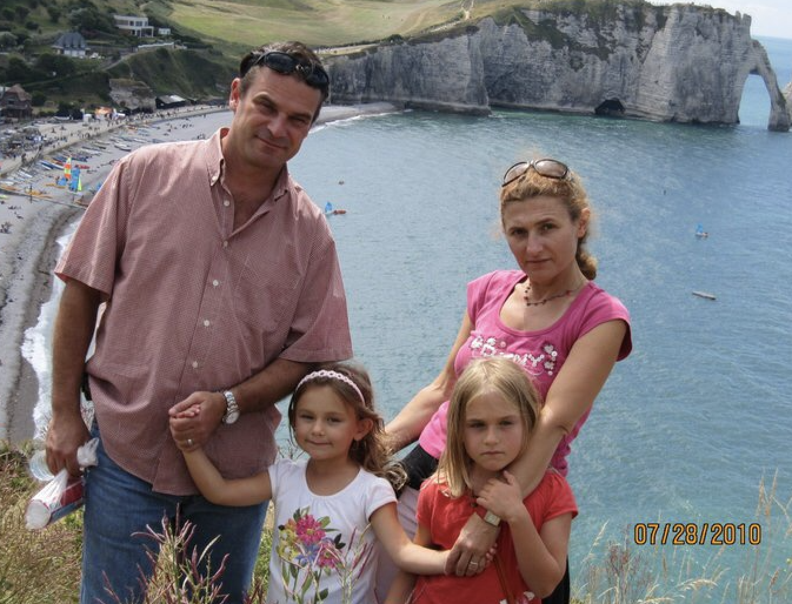
  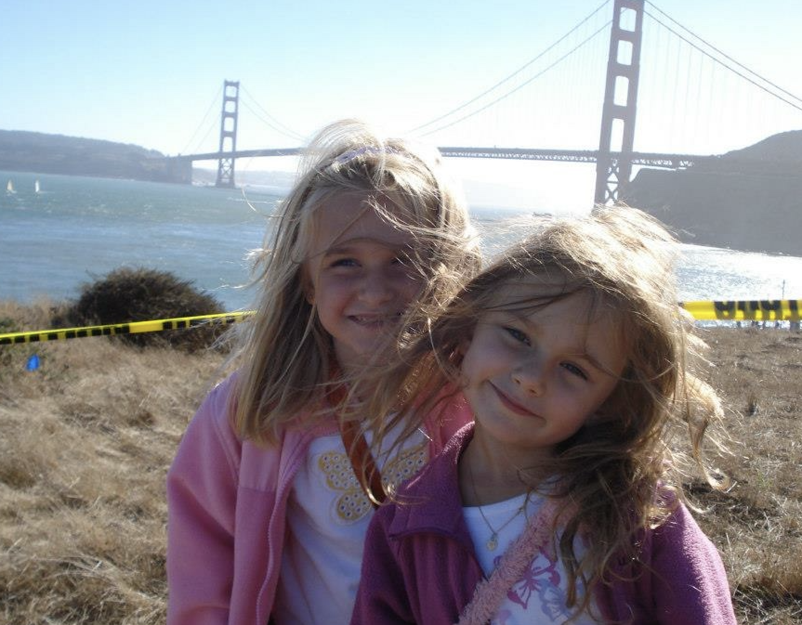
  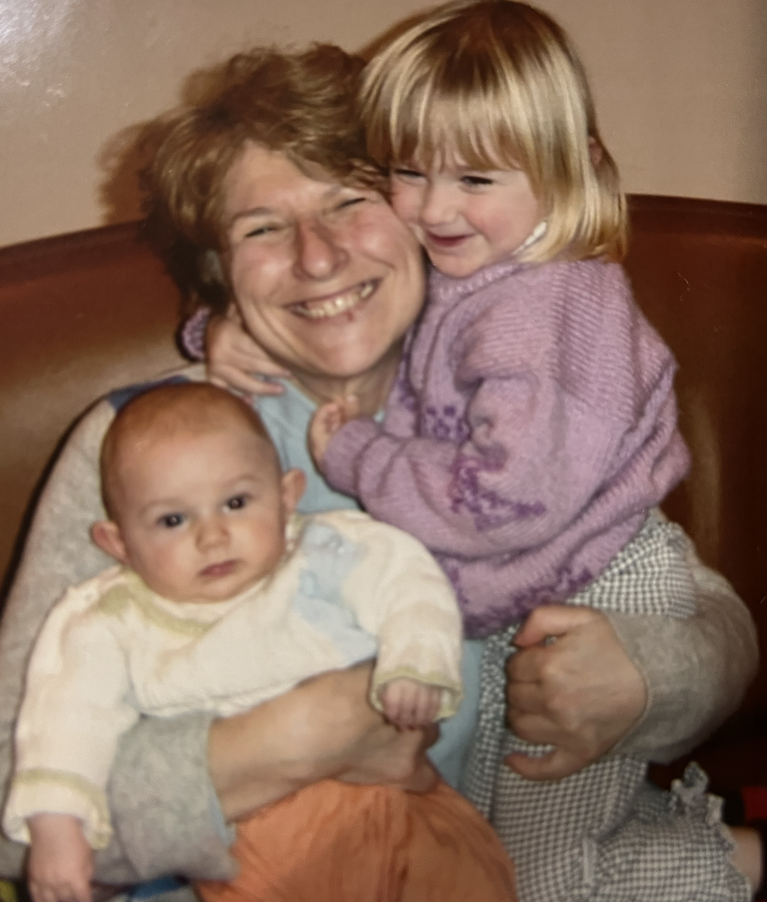
  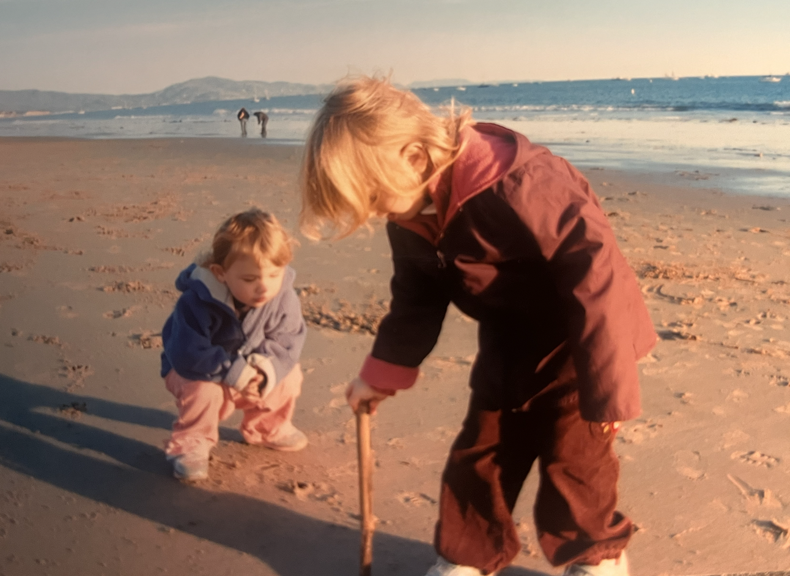
  
  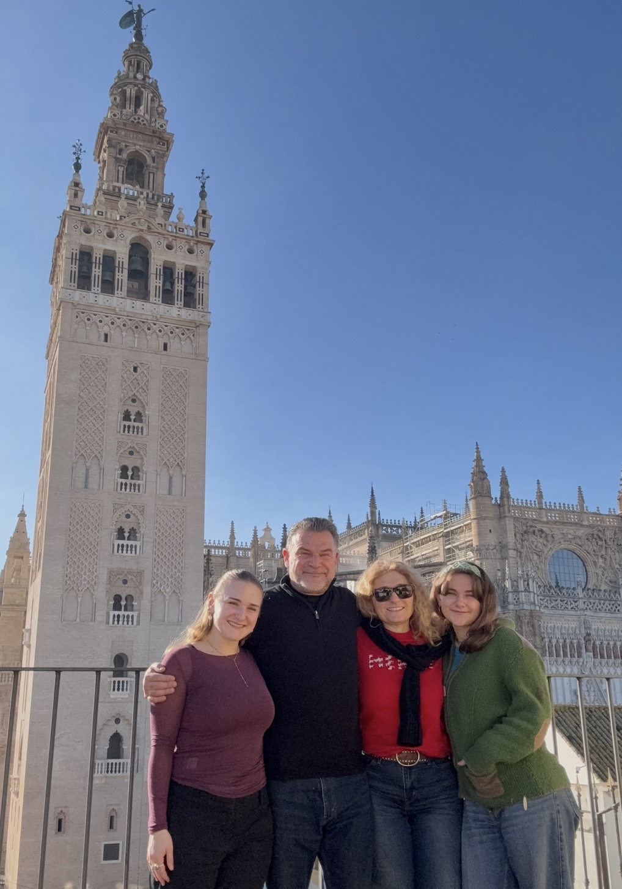

# My happiest place
Journaling in the forest near my house is my happiest place. I also absolutley love discovering new cafés, doing yoga, and playing volleyball! 

  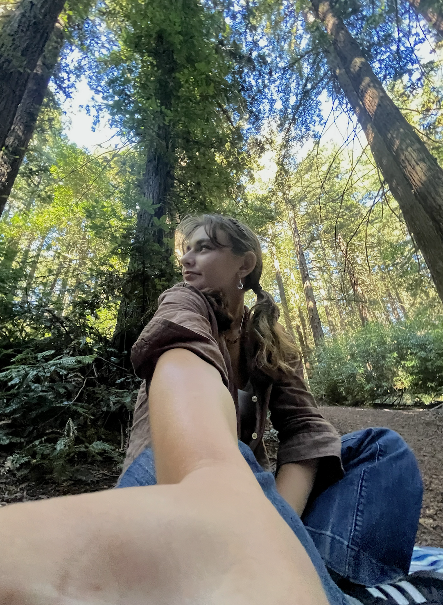
  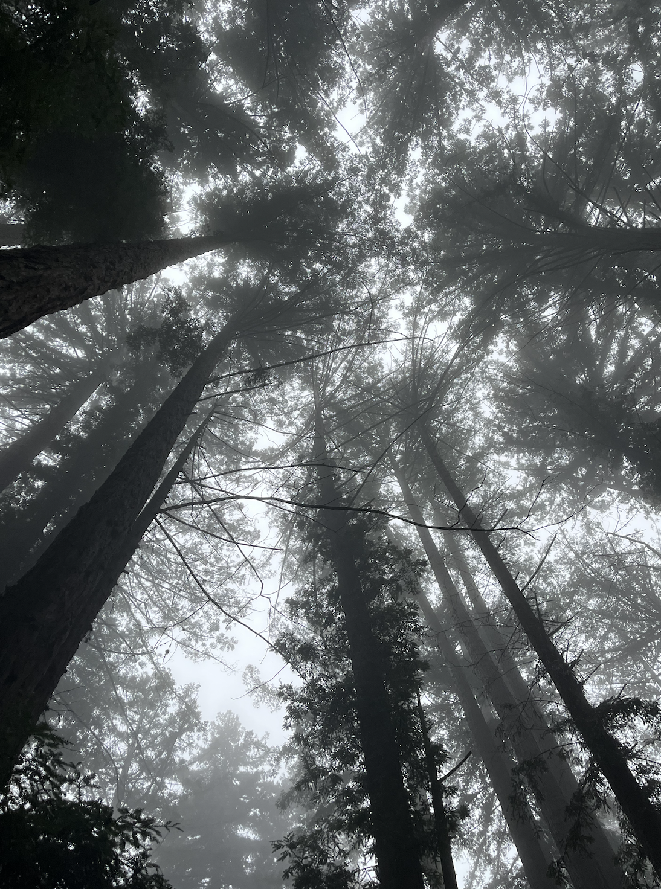

# I am half-Bulgarian
And I grew up hiking in the Bulgarian mountains and speaking the language! Visiting my family and the beautiful country was a big reason that I decided to study the environment.

  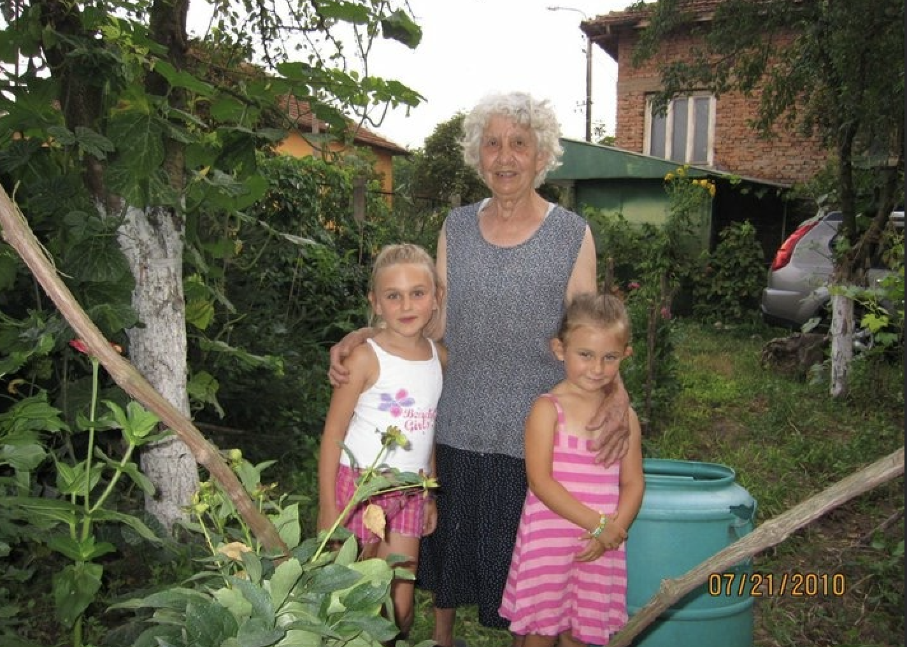
  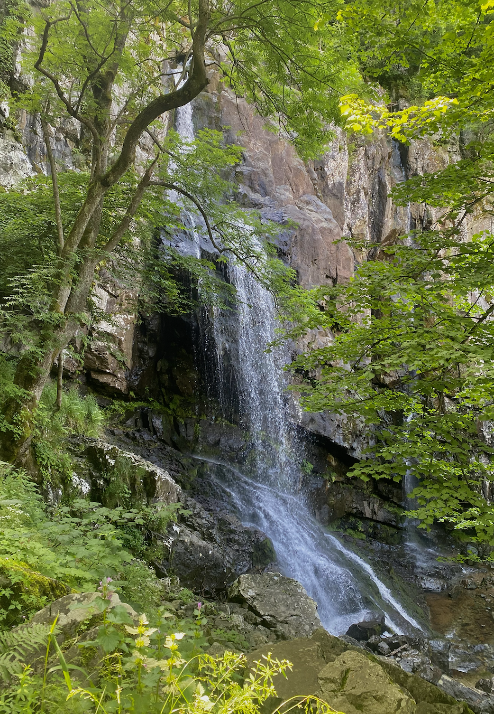
  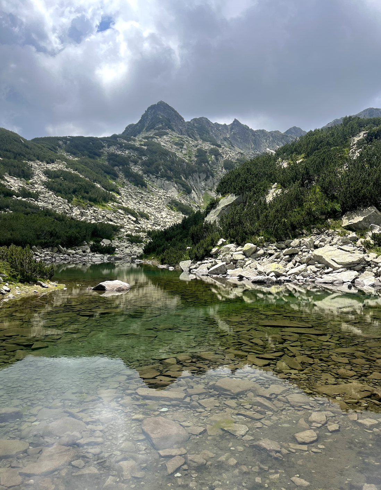

# Fun fact
I lived in Rabat, Morocco for a year when I was younger! 

  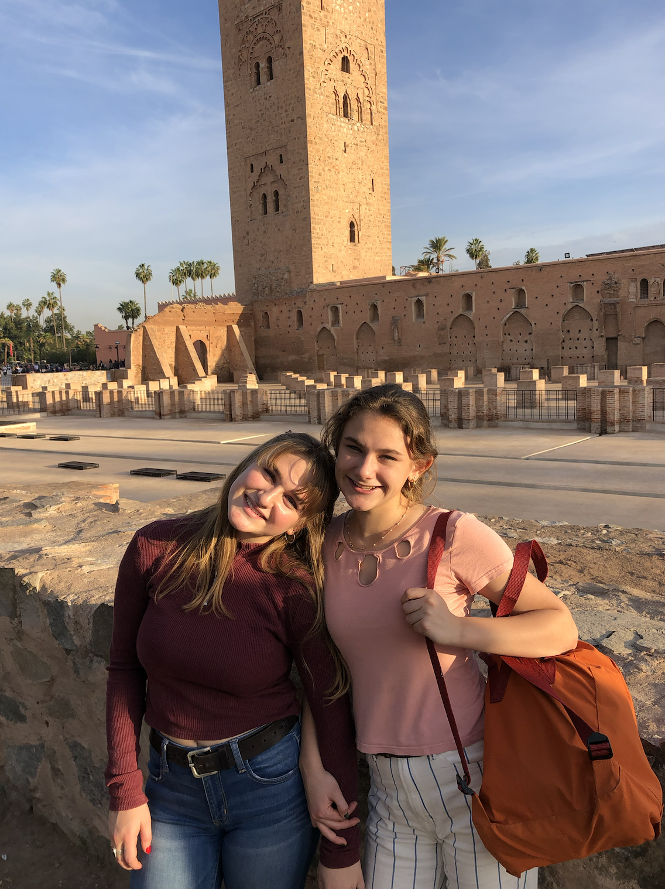
  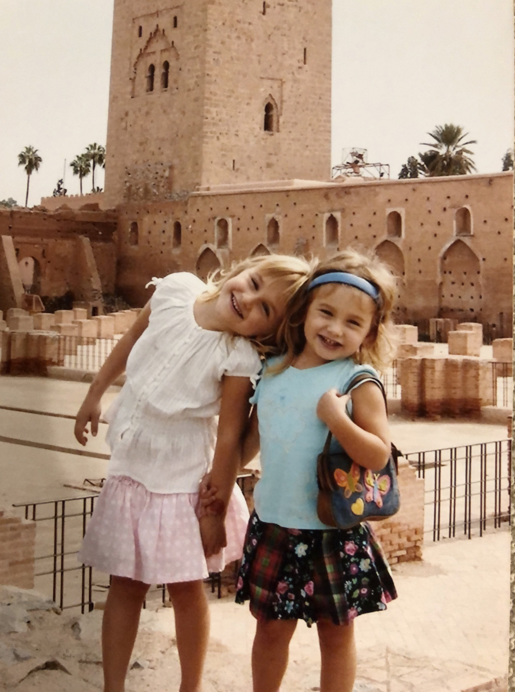

# Madrid!
I studied abroad in Madrid, and I have been studying spanish since the 6th grade. Madrid was a magical place to live and I hope to live in Spain again if I get the chance! 

  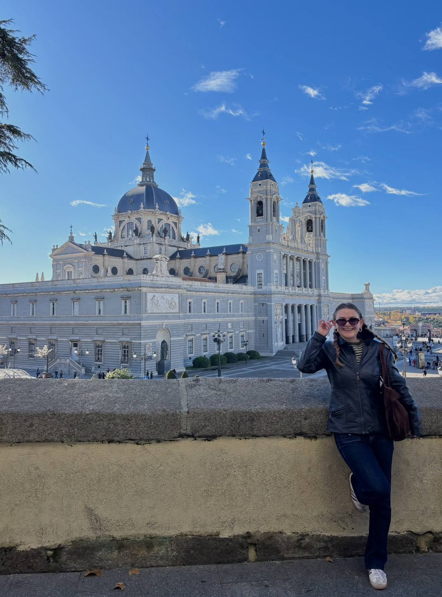
  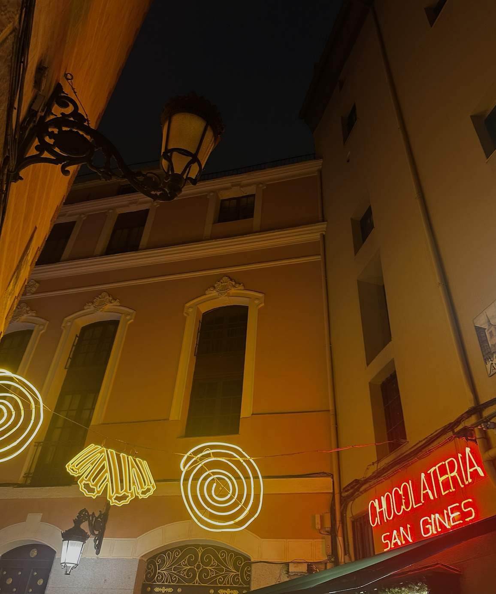

