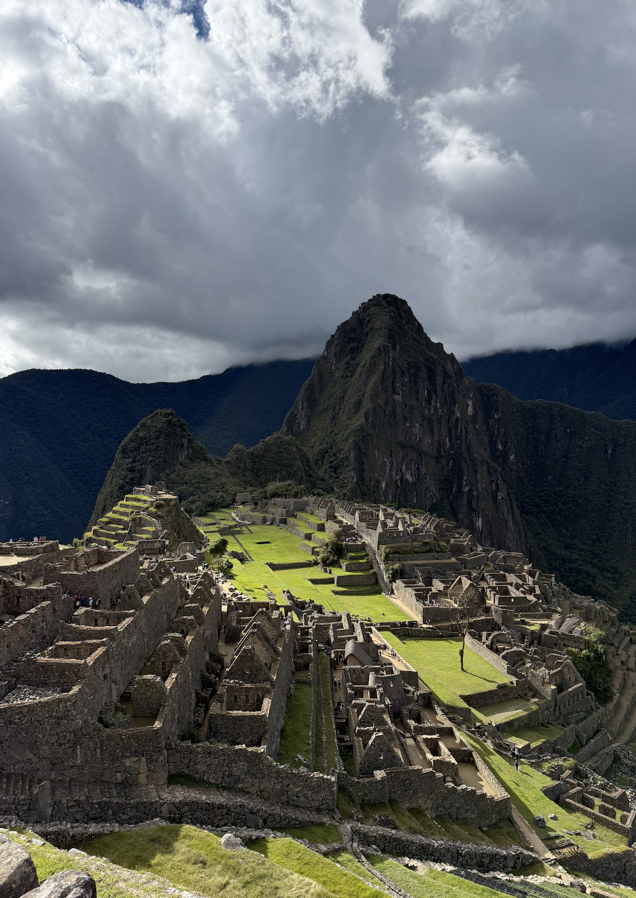
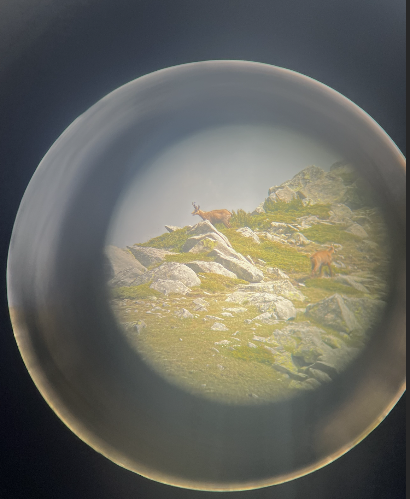
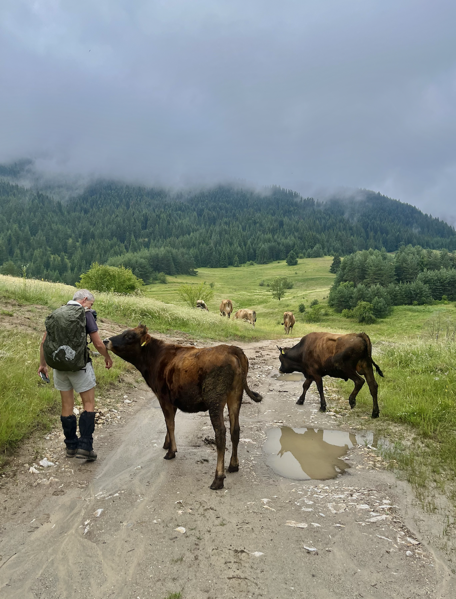
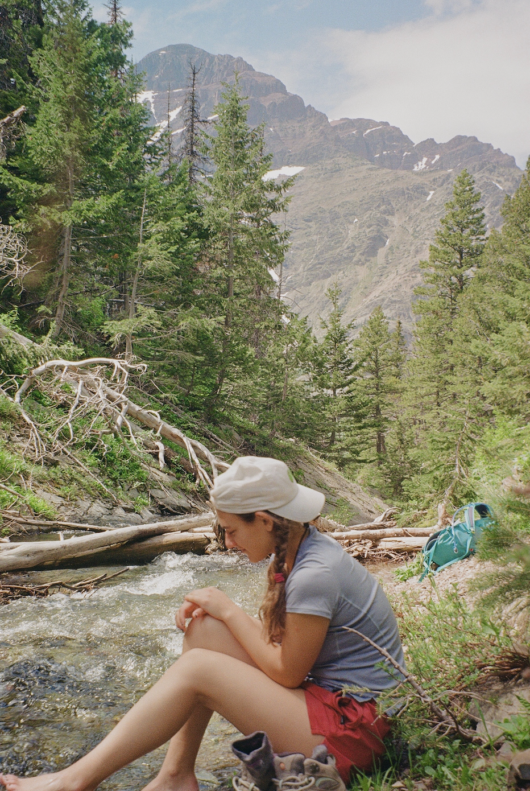

## Peru

  
  

 2025: Hiking Machu Picchu!

## Bulgaria Rewilding in Action: Wildland's Field Study Program

  
  
  
  
s

 2024: While backpacking, I studied the coexistence of large carnivores and humans in the Bulgarian mountains.

## Glacier & Olympic National Park

  
  
  

 2023: Road trip to Oregon, Washington, and Montana.
